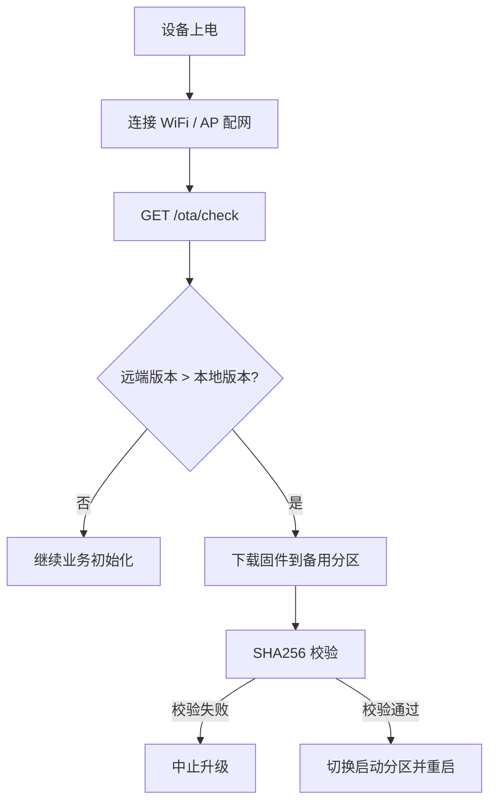
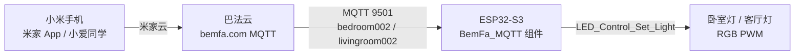

# ESP32-S3 通过 AI 语音识别控制全屋灯光

> 基于 **ESP32-S3-N16R8** 与 **云端 AI 大模型实时语音对话** 的全屋灯光语音控制系统。  
> 支持自然语言控制灯光开关、亮度、颜色，并具备局域网 OTA 远程升级能力。
> 支持通过 **巴法云桥接接入米家智能家居**：米家 App / 小爱同学即可远程控制卧室灯、客厅灯。  


---

## 目录

- [项目简介](#项目简介)
- [功能特性](#功能特性)
- [硬件组成](#硬件组成)
- [系统架构](#系统架构)
- [软件架构](#软件架构)
- [FreeRTOS 任务设计](#freertos-任务设计)
- [Flash 分区表](#flash-分区表设计)
- [OTA 远程升级](#ota-远程升级)
- [米家智能家居接入（巴法云）](#米家智能家居接入巴法云)
- [快速开始](#快速开始)
- [目录结构](#目录结构)
- [图片展示](#图片展示)
- [项目前景](#项目前景)
- [参考文档](#参考文档)

---

## 项目简介

传统开关灯需要走到固定位置手动操作，尤其夜间或双手忙碌时极为不便。本项目以 **ESP32-S3** 为核心，结合**云端 AI 语音识别**（自研端云流水线）实现自然语言控制灯光，提升生活便捷性。

同时，本项目旨在深入学习 **ESP32-S3 与 AI 大模型互联**的软硬件协同设计，涵盖音频采集、播放、显示、PWM 调光、OTA 升级等全栈功能，为后续分布式智能家居系统奠定基础。

## ⚠️ 关键配置（必填）

> **在使用前，必须修改以下两个宏定义，否则无法正常连接云端服务！**

| 宏定义 | 位置 | 用途 | 说明 |
| :----- | :--- | :--- | :--- |
| `AI_CLOUD_TOKEN` | [main.c](components/App/AI_Coud/AI_Cloud.c) | **接入豆包端对端实时语音的认证** | 填写你的 API-Key（Token），用于与豆包（ByteDance）大模型建立 WebSocket 全双工实时语音通道 |
| `BEMFA_MQTT_CLIENT_ID` | [BemFa.c](components/App/BemFa_MQTT/BemFa.c) | **巴法云接入小米智能家居** | 填写你的客户端 ID，用于连接巴法云 MQTT 服务器，实现米家 App / 小爱同学控制灯光 |

### 配置示例

```c
// components/App/AI_Coud/AI_Cloud.c
#define AI_CLOUD_TOKEN "your-api-key-here"

// components/App/BemFa_MQTT/BemFa.c
#define BEMFA_MQTT_CLIENT_ID "your-client-id-here"
```

## 功能特性

- 🎤 **本地 ASR 唤醒词**：使用 ESP-SR 框架实现"小鱼同学"语音唤醒；
- ☁️ **云端 AI 实时对话**：通过 WebSocket 与豆包（ByteDance）大模型全双工实时语音对话；
- 💡 **自然语言控制灯光**：云端通过 MCP 风格工具调用下发结构化指令，控制灯光开关、亮度、颜色；
- 🖥️ **OLED 实时状态显示**：显示卧室/客厅两路灯的状态（开/关、亮度、颜色）；
- 📶 **Wi-Fi AP 配网**：首次上电自动进入 AP 配网模式，通过网页配置 Wi-Fi 凭据；
- 🔄 **局域网 OTA 升级**：开机自动检查版本，发现新固件后自动下载、校验并重启。
- 📱 **米家 App / 小爱同学控制**：通过巴法云 MQTT 桥接接入米家智能家居，手机 App 远程开关灯、调亮度、调颜色；

## 硬件组成

### 核心芯片

- **ESP32-S3-N16R8**：Wi-Fi + BLE 5.0，双核 Xtensa LX7，16MB Flash + 8MB PSRAM

### 外设模块

| 模块 | 用途 |
| ---- | ---- |
| **INMP441** | 数字 I²S 麦克风，语音采集 |
| **NS4168** | I²S 数字功放，语音播报反馈 |
| **SSD1306 OLED（0.96 英寸）** | 显示灯光状态信息 |
| **HW-478 RGB LED 灯珠 ×2** | 三路 RGB PWM 调光，卧室灯 + 客厅灯 |

### 引脚接线

| 模块名称 | 模块引脚 | ESP32-S3 引脚 | 说明 |
| :------- | :------- | :------------ | :--- |
| **INMP441** | VCC | 3.3V | 电源 |
|  | GND | GND | 共地 |
|  | SD | GPIO6 | 数据输出 |
|  | SCK | GPIO7 | 时钟输入 |
|  | WS | GND | 声道选择（接地 = 左声道） |
|  | L/R | GND | 左/右声道选择（接地 = 左声道） |
| **NS4168** | VCC | 3.3V | 电源（注意电流，可接 5V 若支持） |
|  | GND | GND | 共地 |
|  | BCLK | GPIO8 | I²S 位时钟 |
|  | LRCK | GPIO9 | I²S 左右声道时钟 |
|  | SDIN | GPIO10 | I²S 数据输入 |
|  | MCLK | 悬空 | 主时钟（NS4168 内部可倍频，无需外接） |
| **OLED (SSD1306)** | VCC | 3.3V | 电源 |
|  | GND | GND | 共地 |
|  | SDA | GPIO11 | I²C 数据线 |
|  | SCL | GPIO12 | I²C 时钟线 |
| **HW-478 LED1 卧室灯** | R | GPIO1 | 红色 PWM |
|  | G | GPIO2 | 绿色 PWM |
|  | B | GPIO20 | 蓝色 PWM |
|  | GND | GND | 地 |
| **HW-478 LED2 客厅灯** | R | GPIO21 | 红色 PWM |
|  | G | GPIO17 | 绿色 PWM |
|  | B | GPIO18 | 蓝色 PWM |
|  | GND | GND | 地 |

> **注意**：所有模块的 GND 必须共地；INMP441 和 NS4168 的电源建议加 10μF + 0.1μF 去耦电容。

## 系统架构


- **全双工实时通信**：ESP32-S3 通过 WebSocket 与云端大模型建立全双工实时语音通道；
- **MCP 风格工具调用**：云端大模型通过结构化指令（Function Call）控制本地灯光设备；
- **音频流水线**：INMP441 采集 → 上传云端 → 云端返回 OGG/Opus → NS4168 播放；
- **局域网 OTA**：设备上电后自动访问局域网 OTA 服务器检查并升级固件。

## 软件架构

```
project/
├── main/                          # 主程序入口
│   ├── main.c
│   └── CMakeLists.txt
├── components/
│   ├── bsp/                       # 板级支持包（硬件抽象层）
│   │   ├── pwm_driver/            # PWM 封装（LED 调光）
│   │   ├── i2c_driver/            # I²C 封装（OLED）
│   │   ├── i2s_driver/            # I²S 封装（音频输入输出）
│   │   ├── wifi_manager/          # Wi-Fi 连接/重连、AP 配网
│   │   └── audio_codec/           # 音频编解码（OPUS 解码）
│   ├── middlewares/               # 中间件（外设驱动）
│   │   ├── oled/                  # OLED 显示驱动
│   │   ├── LED_Control/           # HW-478 LED 驱动
│   │   ├── microphone/            # INMP441 驱动（I²S 采集成帧）
│   │   └── amplifier/             # NS4168 驱动（I²S 音频输出）
│   ├── Audio_Stream/              # 麦克风/功放数据流控制，支持多消费者
│   ├── App/                       # 应用层
│   │   ├── ASR/                   # ASR 语音唤醒
│   │   ├── AI_Coud/               # 云端大模型通信
│   │   └── BemFa_MQTT/            # 巴法云 MQTT（米家 App / 小爱接入）
│   └── OTA_Update/                # OTA 升级（局域网方案）
├── html/                          # 配网网页资源
├── note/                          # 开发笔记
├── datasheet/                     # 硬件数据手册
└── 服务器端/                        # OTA 服务器端代码
```

## FreeRTOS 任务设计

| 任务名称 | 优先级 | 栈大小 | 功能描述 | 备注 |
| :------- | :----- | :----- | :------- | :--- |
| AI_Cloud 任务 | 10 | 8192 | 从 Audio_Stream 麦克风生产者读取音频数据给云端 AI | |
| ASR 语音唤醒任务 | 8 | 32 * 1024 | 作为麦克风消费者，检测语音唤醒词 | 使用 xTaskCreateStatic 创建，栈大，防止消耗内部 SRAM |
| 音频流生产者任务 | 9 | 8 * 1024 | 麦克风音频流生产者，有数据时唤醒等待中的消费者 | |
| 播放任务 | 7 | 8192 | 从播放队列获取音频数据并播放 | |
| 配网任务 | 2 | 4096 | 无 WiFi 凭据或连接失败时进入 AP 配网 | |
| scan_task | 3 | 8192 | AP 配网时扫描 WiFi 热点 | 隶属于配网任务 |
| OLED 显示任务 | 4 | 2048 | 显示灯光状态 | |
| OTA_Update 任务 | 5 | 12288 | 检查固件版本并执行 OTA 升级 | 实际下载在独立 `ota_sync` 任务中运行，避免栈溢出 |
| BemFa_MQTT 任务 | 6 | 8192 | 等待 Wi-Fi 就绪后连接巴法云，订阅灯控主题并定时上报状态 | 30 秒定时上报一次 |
| app_main | 默认 | 默认 | 各种初始化 | |

> **通信机制**：任务间使用 **FreeRTOS 队列** + **事件标志组**；音频流数据块通过 Audio_Stream 环形缓冲区获取同一份数据。

## Flash 分区表设计

ESP32-S3-N16R8 配备 **16MB 片外 Flash**，采用支持双 OTA（A/B 分区升级）的分区表，确保升级失败时能自动回滚。

```csv
# Name,        Type,   SubType,   Offset,    Size,       Flags
nvs,            data,   nvs,       0x9000,    0x6000,
phy_init,       data,   phy,       0xF000,    0x1000,
ota_data,       data,   ota,       0x10000,   0x2000,
ota_0,          app,    ota_0,     0x20000,   0x500000,
ota_1,          app,    ota_1,     0x520000,  0x500000,
model,          data,   spiffs,    0xA20000,  0x300000,
storage,        data,   spiffs,    0xD20000,  0x2E0000,
```

| 分区 | 偏移量 | 大小 | 说明 |
| :--- | :----- | :--- | :--- |
| nvs | 0x9000 | 24 KB | 保存用户配置、Wi-Fi 校准等 |
| phy_init | 0xF000 | 4 KB | PHY 初始化数据 |
| ota_data | 0x10000 | 8 KB | OTA 状态分区（强制要求） |
| ota_0 | 0x20000 | 5 MB | 应用固件分区 A |
| ota_1 | 0x520000 | 5 MB | 应用固件分区 B（与 A 大小一致） |
| model | 0xA20000 | 3 MB | SPIFFS，存储 AI 模型（esp-sr） |
| storage | 0xD20000 | ~2.88 MB | SPIFFS，存储配网网页等可写数据 |

## OTA 远程升级

项目采用 **"开机自动检测，拉取式升级（Pull-style OTA）"** 的局域网方案，无需人工干预。

### 升级流程



### 服务器端

- 使用 **Flask + Gunicorn** 提供 HTTP 服务；
- `/ota/check`：返回最新固件版本号、SHA256、下载 URL；
- `/ota/download/<filename>`：流式提供 `.bin` 固件下载；
- 自动扫描固件目录，从文件名提取版本号并排序；
- 生产环境建议使用 Gunicorn 启动：

```bash
gunicorn -w 4 -k gthread --threads 4 -b 0.0.0.0:5000 --timeout 120 ota_server:app
```

服务器端代码位于 `服务器端/home/ub/ota_server.py`，详细设计见 [服务器端/ota远程升级设计.md](%E6%9C%8D%E5%8A%A1%E5%99%A8%E7%AB%AF/ota%E8%BF%9C%E7%A8%8B%E5%8D%87%E7%BA%A7%E8%AE%BE%E8%AE%A1.md)。


### 客户端

- `OTA_Update_Init()` 自动读取当前运行固件版本；
- `OTA_Update_CheckAndUpgrade()` 同步检查升级，下载过程在独立 `ota_sync` 任务中执行；
- 下载过程中实时计算 SHA256，与服务器返回值比对，校验失败自动中止；
- 校验通过后切换启动分区并重启；
- 当前工程默认未开启 bootloader 自动回滚（`CONFIG_BOOTLOADER_APP_ROLLBACK_ENABLE`）。


## 米家智能家居接入（巴法云）

本项目通过 **巴法云（bemfa.com）** 将自研 RGB 灯接入小米智能家居生态：ESP32-S3 作为 MQTT 客户端连接巴法云，手机 **米家 App** 绑定巴法云账号后，即可像控制普通米家灯一样控制卧室灯、客厅灯，也可用小爱同学语音控制。

### 数据链路



### 功能与限制

- **支持控制**：开关、亮度（1~100）、颜色（米家下发十进制 RGB，ESP32 拆分为 RGB 分量）；
- **米家 App 显示**：两盏灯卡片——卧室灯、客厅灯（对应巴法云主题 `bedroom002`、`livingroom002`）；
- **语音控制**：小爱音箱 / 手机小爱 App 直接说"小爱同学，打开卧室灯"即可；
- **限制说明**：走第三方云 + 公网链路；米家 App 侧颜色与色温映射不完善，颜色调节建议优先使用 AI 语音或后续自建网页。

### 使用流程

1. 在巴法云控制台创建主题（主题名后三位 `002` 表示灯泡设备）并设置昵称；
2. 米家 App → **我的** → **其他平台设备** → 添加 → 绑定"巴法"账号 → 同步设备；
3. ESP32 上电联网后自动连接巴法云并订阅灯控主题；
4. 在米家 App 中即可开关灯、调亮度、调颜色。

### 效果展示


> 详细接入步骤、消息协议与代码说明见 [接入米家智能家居手册.md](%E6%8E%A5%E5%85%A5%E7%B1%B3%E5%AE%B6%E6%99%BA%E8%83%BD%E5%AE%B6%E5%B1%85%E6%89%8B%E5%86%8C.md)。

## 快速开始

### 环境要求

- ESP-IDF **v5.2.6**
- Python 3.x（服务器端）
- ESP32-S3-N16R8 开发板

### 编译烧录

```bash
# 设置 IDF 环境后
idf.py set-target esp32s3
idf.py menuconfig          # 按需配置分区表 / HTTP OTA
idf.py build
idf.py -p /dev/ttyUSB0 flash monitor
```

### 服务器端部署

```bash
# 安装依赖
pip3 install flask flask-cors gunicorn

# 放置固件到目录（按版本号命名）
# /home/ub/OTA_Bin/1.0.0.bin

# 启动 OTA 服务器
gunicorn -w 4 -k gthread --threads 4 -b 0.0.0.0:5000 --timeout 120 ota_server:app
```

### 使用流程

1. 设备上电，若无 WiFi 凭据则进入 AP 配网；
2. 手机连接设备热点，完成 WiFi 配置；
3. 设备连接 WiFi 后自动检查 OTA 并进入业务初始化；
4. 说唤醒词"小鱼同学"，开始语音对话；
5. 通过自然语言控制卧室灯/客厅灯。
6. （可选）在米家 App 绑定巴法云账号，即可用米家 App / 小爱同学控制灯光。

## 目录结构

```
├── main/                    # 主程序入口
├── components/              # 项目组件
│   ├── bsp/                 # 板级支持包
│   ├── middlewares/         # 中间件
│   ├── Audio_Stream/        # 音频流
│   ├── App/                 # 应用层（ASR、AI Cloud、巴法云 MQTT）
│   └── OTA_Update/          # OTA 升级
├── html/                    # 配网网页
├── note/                    # 开发笔记
├── datasheet/               # 数据手册
├── img/                     # 图片资源
├── 服务器端/                  # OTA 服务器代码
├── 架构图.drawio             # 架构图源文件
├── 架构图.jpg                # 架构图
├── partitions.csv           # 分区表
└── 项目文档.md                # 详细项目文档
├── 接入米家智能家居手册.md   # 米家接入（巴法云）详细手册
```

## 图片展示

| 图片 | 说明 |
| :--- | :--- |
|  | 项目实物图 |
|  | OTA 服务器端 |
|  | 访问 OTA 服务器验证 |
|  | 巴法云控制台看到卧室灯/客厅灯设备在线 |
|  | 米家 App 中控制卧室灯/客厅灯 |
|  | 米家 App 控制灯光效果 |

## 项目前景

1. **私有化部署**：将云端网关部署到内网服务器，实现全本地 AI 控制；
2. **多模态扩展**：在协议中增加图像帧类型，实现"语音 + 视觉"多模态控制；
3. **多设备协同**：在 MCP 指令中增加 `target_device` 字段，实现全屋多芯片联动；
4. **自定义唤醒词**：基于 ESP-SR 框架增加本地唤醒，大幅降低云端费用；
5. **协议开放**：开源二进制协议，方便其他开发者接入；
6. **局域网 OTA 增强**：开发手机 APP/小程序，一键批量升级设备。
7. **米家生态联动**：在巴法云桥接基础上，接入米家智能场景（如开门自动开灯、离家全关灯）。

## 参考文档

- [项目文档.md](%E9%A1%B9%E7%9B%AE%E6%96%87%E6%A1%A3.md)
- [服务器端/ota远程升级设计.md](%E6%9C%8D%E5%8A%A1%E5%99%A8%E7%AB%AF/ota%E8%BF%9C%E7%A8%8B%E5%8D%87%E7%BA%A7%E8%AE%BE%E8%AE%A1.md)
- [note/ 开发笔记](note)
- [接入米家智能家居手册.md](%E6%8E%A5%E5%85%A5%E7%B1%B3%E5%AE%B6%E6%99%BA%E8%83%BD%E5%AE%B6%E5%B1%85%E6%89%8B%E5%86%8C.md)

---

*所有硬件模块的详细数据手册、原理图及应用笔记均放置在 `datasheet/` 文件夹中，供开发者查阅。*