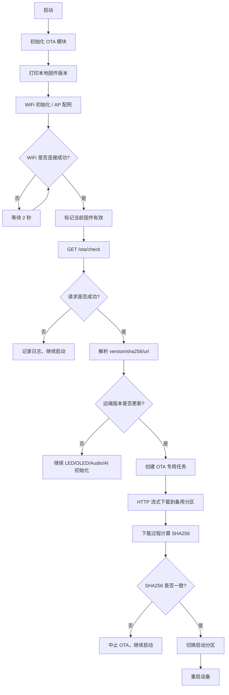

# OTA 远程升级设计

## 1. 概述

本项目 ESP32-S3 固件采用 **局域网 Pull-style OTA** 方案。设备上电并连接 WiFi 后，主动访问局域网内 Python OTA 服务器：

1. 请求 `/ota/check` 获取最新固件版本、SHA256 和下载地址；
2. 将远端版本与本地运行固件版本做语义化比较；
3. 如果远端版本更新，则通过 HTTP 流式下载固件到备用 `app` 分区；
4. 下载过程中计算数据流 SHA256，下载完成后与服务器返回值比对；
5. 校验通过后切换启动分区并重启；
6. 如果没有新版本，则继续执行后续业务初始化。

OTA 模块与 WiFi、音频、AI Cloud 等业务模块解耦，只通过事件回调通知上层状态变化。

## 2. 服务器端设计

服务器使用 Flask，主要接口如下：

| 接口 | 方法 | 说明 |
|------|------|------|
| `/ota/check` | GET | 返回最新固件的版本号、SHA256、下载 URL |
| `/ota/download/<filename>` | GET | 流式返回指定 `.bin` 固件文件 |

### 2.1 `/ota/check` 返回示例

```json
{
  "version": "1.2.0",
  "sha256": "712d57464257c0e5e5e9d4cfd85c85f29c7fd091bb5730a3f48033b22794484b",
  "url": "http://192.168.4.16:5000/ota/download/1.2.0.bin"
}
```

### 2.2 服务器端核心逻辑

- 扫描固件目录下所有 `.bin` 文件；
- 文件名去掉 `.bin` 后缀后作为版本号；
- 每个文件计算 SHA256；
- 使用 `LooseVersion` 对版本号排序，返回最新版本；
- 下载接口只允许下载文件名，防止路径穿越。

### 2.3 固件命名建议

建议使用语义化版本号命名：

```text
1.0.0.bin
1.0.10.bin
1.2.0.bin
v1.2.0.bin
```

客户端版本比较函数会忽略 `v`、`esp_v` 等非数字前缀，因此 `v1.2.0`、`esp_v1.2.0.bin` 也能正确解析为 `1.2.0`。

## 3. 客户端模块设计

### 3.1 模块位置

```text
components/
└── OTA_Update/
    ├── CMakeLists.txt
    ├── OTA_Update.h
    └── OTA_Update.c
```

### 3.2 模块依赖

`CMakeLists.txt` 中声明依赖：

```cmake
REQUIRES driver app_update esp_https_ota esp_partition esp_http_client json mbedtls
```

### 3.3 公共 API

| 函数 | 说明 |
|------|------|
| `OTA_Update_Init()` | 初始化模块，读取配置和本地版本号 |
| `OTA_Update_RegisterEventCallback()` | 注册 OTA 事件回调 |
| `OTA_Update_Start()` | 启动后台周期检测任务 |
| `OTA_Update_CheckAndUpgrade()` | 执行一次同步检测升级 |
| `OTA_Update_MarkAppValid()` | 标记当前固件有效，取消自动回滚 |
| `OTA_Update_IsBusy()` | 查询模块是否忙碌 |
| `OTA_Update_GetLocalVersion()` | 获取当前运行固件版本 |
| `OTA_Update_GetRemoteVersion()` | 获取最近一次检查到的远端版本 |

### 3.4 默认配置

```c
#define OTA_SERVER_CHECK_URL "http://192.168.1.100:5000/ota/check"
#define OTA_LOCAL_VERSION     "1.0.0"
#define OTA_CHECK_TIMEOUT_MS  5000
#define OTA_DOWNLOAD_TIMEOUT_MS 60000
#define OTA_TASK_STACK_SIZE   12288
#define OTA_TASK_PRIORITY     5
```

## 4. 客户端核心流程



## 5. 版本比较策略

客户端没有直接使用字符串比较，而是把版本号解析成数字段后逐段比较：

```c
static int ota_compare_versions(const char *a, const char *b)
{
    uint32_t pa[OTA_VERSION_COMPONENTS] = {0};
    uint32_t pb[OTA_VERSION_COMPONENTS] = {0};
    size_t ca = 0;
    size_t cb = 0;

    if (!ota_parse_version(a, pa, &ca) || !ota_parse_version(b, pb, &cb))
    {
        return 0;
    }

    size_t max_components = ca > cb ? ca : cb;
    for (size_t i = 0; i < max_components; i++)
    {
        if (pa[i] < pb[i]) return -1;
        if (pa[i] > pb[i]) return 1;
    }

    return 0;
}
```

解析函数会先跳过所有非数字字符，因此支持：

- `1.0.0`
- `v1.0.10`
- `esp_v1.0.1.bin`

且能正确处理 `1.0.10 > 1.0.9`。

## 6. SHA256 校验

下载阶段不使用一次性缓存整个固件，而是边下载边计算 SHA256：

```c
static esp_err_t ota_http_event_handler(esp_http_client_event_t *evt)
{
    ota_download_ctx_t *ctx = (ota_download_ctx_t *)evt->user_data;

    if (evt->event_id == HTTP_EVENT_ON_DATA)
    {
        mbedtls_sha256_update(&ctx->sha_ctx, evt->data, evt->data_len);
        ctx->received_bytes += evt->data_len;
    }

    return ESP_OK;
}
```

下载完成后：

```c
mbedtls_sha256_finish(&dl_ctx.sha_ctx, computed_hash);
```

再与服务器返回的十六进制 SHA256 做不区分大小写比较。校验失败会调用 `esp_https_ota_abort()` 中止升级。

## 7. 分区与双 OTA

使用 `partitions.csv` 中的双 `app` 分区：

```text
ota_data, data, ota, 0x10000,  0x2000
ota_0,    app,  ota_0, 0x20000, 0x500000
ota_1,    app,  ota_1, 0x520000, 0x500000
```

- `ota_0` 和 `ota_1` 大小均为 5 MB；
- 当前固件运行在其中一个分区，升级时写入另一个备用分区；
- 下载完成后切换启动分区；
- 如果新固件运行异常，可由回滚机制切回旧分区。

## 8. 回滚与 App Valid

当启用 `CONFIG_BOOTLOADER_APP_ROLLBACK_ENABLE` 时：

1. 新固件首次启动后处于 `ESP_OTA_IMG_PENDING_VERIFY` 状态；
2. WiFi 连接成功且系统正常后，调用 `OTA_Update_MarkAppValid()`；
3. 该函数会调用 `esp_ota_mark_app_valid_cancel_rollback()` 取消回滚；
4. 如果新固件启动后崩溃，设备重启时自动回退到旧固件。

当前 `sdkconfig` 中 `CONFIG_BOOTLOADER_APP_ROLLBACK_ENABLE` 未开启，因此 `OTA_Update_MarkAppValid()` 只打印日志并返回 `ESP_OK`。

## 9. WiFi 与 AP 配网等待

OTA 检查必须在 WiFi 真正连接成功之后执行。`main.c` 中的处理：

```c
WifiManager_Wifi_Init();

// AP 配网完成前 OTA 不能开始，阻塞等待 WiFi 真正连接成功
while(!WifiManager_IsConnected())
{
    ESP_LOGI(TAG, "Waiting for WiFi connection before OTA...");
    vTaskDelay(pdMS_TO_TICKS(2000));
}

OTA_Update_MarkAppValid();

if(ota_ready)
{
    OTA_Update_CheckAndUpgrade();
}
```

- 已有 WiFi 凭据：连接成功后立即进入 OTA 检查；
- 无凭据进入 AP 配网：OTA 检查会等待，直到用户完成配网并连接 WiFi。

## 10. 栈溢出问题与解决

OTA 下载涉及 HTTP Client、HTTPS OTA、JSON 解析和 SHA256 计算，栈占用较大。

如果直接在 `main` 任务中调用 `OTA_Update_CheckAndUpgrade()`，会因 main 任务栈过小导致：

```text
vApplicationStackOverflowHook
CORRUPTED
```

解决方法：

- 将同步 OTA 检查也放入独立任务 `ota_sync_task` 中执行；
- main 任务只等待信号量，不参与实际下载；
- OTA 任务栈大小设置为 `12288` 字节。

```c
BaseType_t ret = xTaskCreate(ota_sync_task, "ota_sync",
                             OTA_TASK_STACK_SIZE, NULL,
                             OTA_TASK_PRIORITY, NULL);

xSemaphoreTake(s_sync_done, portMAX_DELAY);
```

## 11. main.c 接入示例

```c
#include "OTA_Update.h"

void app_main(void)
{
    // 初始化 NVS
    ...

    // 初始化 OTA 模块，并打印本地版本
    ota_update_config_t ota_config = {0};
    bool ota_ready = false;

    err = OTA_Update_Init(&ota_config);
    if(err != ESP_OK)
    {
        ESP_LOGE(TAG, "OTA_Update init failed: %s", esp_err_to_name(err));
    }
    else
    {
        ota_ready = true;
        ESP_LOGI("+++++Version+++++", "Local firmware version: %s",
                 OTA_Update_GetLocalVersion());
    }

    // 连接 WiFi
    WifiManager_Wifi_Init();

    // 等待 WiFi 连接成功
    while(!WifiManager_IsConnected())
    {
        ESP_LOGI(TAG, "Waiting for WiFi connection before OTA...");
        vTaskDelay(pdMS_TO_TICKS(2000));
    }

    OTA_Update_MarkAppValid();

    if(ota_ready)
    {
        err = OTA_Update_CheckAndUpgrade();
        if(err != ESP_OK)
        {
            ESP_LOGW(TAG, "OTA check failed, continue boot: %s",
                     esp_err_to_name(err));
        }
    }

    // 继续后续业务初始化
    ...
}
```

## 12. 测试结果

已完成测试，验证通过：

- 启动后正确打印本地固件版本；
- 有 WiFi 凭据时能自动连接并检查 OTA；
- 远端版本高于本地版本时能自动下载、校验并重启；
- AP 配网模式下能等待 WiFi 连接成功后再检查 OTA；
- OTA 下载阶段不再发生栈溢出。

## 13. 注意事项

1. ESP32 与 OTA 服务器必须处于同一局域网；
2. 服务器 IP 应保持稳定，建议使用静态 IP；
3. 下载超时时间可根据固件大小调整 `OTA_DOWNLOAD_TIMEOUT_MS`；
4. 如果固件较大，可继续增大 `OTA_TASK_STACK_SIZE`；
5. 当前局域网环境使用 HTTP，需确保 `CONFIG_ESP_HTTPS_OTA_ALLOW_HTTP` 已开启；
6. 服务器暂不可达时，`OTA_Update_CheckAndUpgrade()` 返回错误，设备应记录日志后继续启动，避免因网络异常卡死。